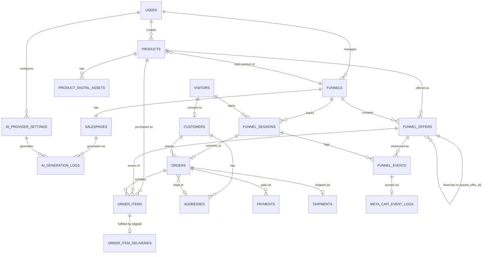

# ERD — Sales Funnel Platform (jowshop)

Status: Draft v1 — turunan dari [PRD.md](./PRD.md)
Konvensi: `bigIncrements` PK, `snake_case` table, FK `*_id`, timestamps standar Laravel kecuali disebutkan lain.

---

## 1. Diagram Relasi (Mermaid)

---

## 2. Detail Entitas

### 2.1 `users` *(sudah ada — bawaan starter kit)*
Admin/staff pengelola toko. Tidak diubah strukturnya di fase ini; ditambah relasi `created_by` di entitas lain.

### 2.2 `products`
| Kolom | Tipe | Keterangan |
|---|---|---|
| id | bigIncrements | |
| created_by | FK users | owner produk (audit, siap multi-tenant) |
| name | string | |
| slug | string unique | |
| type | enum(`digital`,`physical`) | |
| description | text | |
| price | decimal(12,2) | harga normal |
| thumbnail_path | string nullable | |
| sku | string nullable | |
| status | enum(`draft`,`published`,`archived`) | |
| weight_grams | int nullable | wajib jika `physical` |
| length_cm / width_cm / height_cm | decimal nullable | untuk kalkulasi ongkir volumetrik |
| stock | int nullable | wajib jika `physical`, null = unlimited (digital) |
| timestamps | | |

### 2.3 `product_digital_assets`
| Kolom | Tipe | Keterangan |
|---|---|---|
| id | bigIncrements | |
| product_id | FK products | |
| file_path | string nullable | file di storage |
| external_url | string nullable | alternatif link eksternal |
| license_type | enum(`none`,`serial_key`,`account`) | |
| max_downloads | int nullable | null = unlimited |
| timestamps | | |

### 2.4 `funnels`
| Kolom | Tipe | Keterangan |
|---|---|---|
| id | bigIncrements | |
| created_by | FK users | |
| product_id | FK products | produk utama funnel |
| name | string | |
| slug | string unique | URL publik funnel |
| status | enum(`draft`,`published`,`archived`) | |
| thank_you_content | json nullable | konten halaman thank you |
| pixel_settings | json nullable | `{fb_pixel_id, tiktok_pixel_id, ga4_id, google_ads_id}` |
| timestamps | | |

### 2.5 `salespages`
Relasi 1:1 ke `funnels`.

| Kolom | Tipe | Keterangan |
|---|---|---|
| id | bigIncrements | |
| funnel_id | FK funnels unique | |
| title | string | |
| content | json | array of blocks: `{type, data}` (headline, benefit_list, testimonial, faq, cta, dst) |
| seo_title | string nullable | |
| seo_description | string nullable | |
| og_image_path | string nullable | |
| generated_by_ai | boolean default false | |
| published_at | timestamp nullable | |
| timestamps | | |

### 2.6 `funnel_offers`
Menyatukan **Order Bump, Upsell, Downsell** dalam satu struktur pohon percabangan (mendukung chain bump→bump, upsell→downsell sepanjang apapun — lihat contoh Kopi di PRD §5).

| Kolom | Tipe | Keterangan |
|---|---|---|
| id | bigIncrements | |
| funnel_id | FK funnels | |
| product_id | FK products | produk yang ditawarkan di offer ini |
| parent_offer_id | FK funnel_offers nullable, self-ref | null = offer pertama di stage-nya |
| trigger_condition | enum(`initial`,`accepted`,`declined`) | kondisi dari parent yang memunculkan offer ini |
| stage | enum(`bump`,`upsell`,`downsell`) | `bump` = tampil di checkout; `upsell`/`downsell` = tampil post-purchase |
| sequence | int | urutan tampil di antara sibling |
| headline | string | |
| description | text nullable | |
| media_url | string nullable | |
| price_override | decimal(12,2) nullable | override harga produk untuk offer ini |
| discount_type | enum(`none`,`percentage`,`fixed`) nullable | |
| discount_value | decimal(12,2) nullable | |
| is_active | boolean default true | |
| timestamps | | |

### 2.7 `visitors`
| Kolom | Tipe | Keterangan |
|---|---|---|
| id | bigIncrements | |
| uuid | uuid unique | disimpan di cookie first-party, identitas publik visitor |
| ip_address | string nullable | |
| user_agent | string nullable | |
| device_type | enum(`desktop`,`mobile`,`tablet`,`unknown`) nullable | |
| referrer | string nullable | |
| landing_url | string nullable | URL pertama kali visitor masuk |
| utm_source / utm_medium / utm_campaign / utm_term / utm_content | string nullable | |
| fbp | string nullable | cookie `_fbp` (Meta browser ID), untuk Advanced Matching CAPI |
| fbc | string nullable | cookie `_fbc` (Meta click ID dari iklan), untuk Advanced Matching CAPI |
| first_seen_at | timestamp | |
| last_seen_at | timestamp | |
| customer_id | FK customers nullable | terisi setelah visitor konversi jadi pembeli |
| timestamps | | |

### 2.8 `funnel_sessions`
Satu kali visitor melewati satu funnel.

| Kolom | Tipe | Keterangan |
|---|---|---|
| id | bigIncrements | |
| visitor_id | FK visitors | |
| funnel_id | FK funnels | |
| order_id | FK orders nullable | terisi jika sesi ini berkonversi jadi order |
| status | enum(`active`,`converted`,`abandoned`) | |
| started_at | timestamp | |
| completed_at | timestamp nullable | |
| timestamps | | |

### 2.9 `funnel_events`
Tabel append-only — inti dari "tracking lengkap". Satu baris = satu kejadian.

| Kolom | Tipe | Keterangan |
|---|---|---|
| id | bigIncrements | |
| funnel_session_id | FK funnel_sessions | |
| funnel_offer_id | FK funnel_offers nullable | terisi jika event terkait sebuah offer |
| event_type | enum | lihat daftar di bawah |
| external_event_id | uuid unique | dipakai sebagai `event_id` yang sama di Meta Pixel (browser) & Meta CAPI (server) untuk deduplikasi |
| metadata | json nullable | data tambahan bebas (mis. amount, method) |
| occurred_at | timestamp | |

`event_type` yang didukung: `salespage_view`, `checkout_view`, `checkout_submitted`, `bump_view`, `bump_accepted`, `bump_declined`, `upsell_view`, `upsell_accepted`, `upsell_declined`, `downsell_view`, `downsell_accepted`, `downsell_declined`, `payment_pending`, `payment_success`, `payment_failed`, `thankyou_view`.

### 2.10 `customers`
| Kolom | Tipe | Keterangan |
|---|---|---|
| id | bigIncrements | |
| name | string | |
| email | string | |
| phone | string nullable | |
| timestamps | | |

Index unik gabungan `email` untuk find-or-create saat checkout (guest checkout, tanpa perlu login).

### 2.11 `addresses`
| Kolom | Tipe | Keterangan |
|---|---|---|
| id | bigIncrements | |
| customer_id | FK customers | |
| recipient_name | string | |
| phone | string | |
| province | string | |
| city | string | |
| district | string | |
| postal_code | string | |
| address_line | text | |
| notes | text nullable | |
| timestamps | | |

### 2.12 `orders`
| Kolom | Tipe | Keterangan |
|---|---|---|
| id | bigIncrements | |
| funnel_id | FK funnels | |
| customer_id | FK customers | |
| address_id | FK addresses nullable | null jika semua item digital |
| visitor_id | FK visitors nullable | untuk penautan balik ke journey |
| order_number | string unique | nomor order human-readable |
| subtotal | decimal(12,2) | |
| discount_total | decimal(12,2) default 0 | |
| shipping_cost | decimal(12,2) default 0 | |
| total | decimal(12,2) | |
| status | enum(`pending`,`paid`,`processing`,`shipped`,`completed`,`cancelled`,`expired`) | |
| timestamps | | |

### 2.13 `order_items`
| Kolom | Tipe | Keterangan |
|---|---|---|
| id | bigIncrements | |
| order_id | FK orders | |
| product_id | FK products | |
| funnel_offer_id | FK funnel_offers nullable | null = produk utama (bukan dari offer) |
| offer_type | enum(`main`,`bump`,`upsell`,`downsell`) | snapshot kategori |
| quantity | int default 1 | |
| unit_price | decimal(12,2) | harga saat transaksi (snapshot, bukan rujuk ke products.price) |
| timestamps | | |

### 2.14 `order_item_deliveries`
Fulfillment produk digital.

| Kolom | Tipe | Keterangan |
|---|---|---|
| id | bigIncrements | |
| order_item_id | FK order_items unique | |
| download_token | string unique | |
| license_key | string nullable | |
| max_downloads | int nullable | |
| download_count | int default 0 | |
| expires_at | timestamp nullable | |
| delivered_at | timestamp nullable | |
| timestamps | | |

### 2.15 `shipments`
Fulfillment produk fisik (1 order fisik → 1 shipment, disederhanakan; multi-paket bisa jadi 1:N di fase lanjutan).

| Kolom | Tipe | Keterangan |
|---|---|---|
| id | bigIncrements | |
| order_id | FK orders unique | |
| courier | string | mis. `jne`, `jnt`, `sicepat` |
| service | string | mis. `REG`, `YES` |
| cost | decimal(12,2) | |
| tracking_number | string nullable | |
| status | enum(`pending`,`processing`,`shipped`,`delivered`,`failed`) | |
| shipped_at | timestamp nullable | |
| delivered_at | timestamp nullable | |
| timestamps | | |

### 2.16 `payments`
| Kolom | Tipe | Keterangan |
|---|---|---|
| id | bigIncrements | |
| order_id | FK orders | |
| gateway | string default `duitku` | |
| merchant_order_id | string unique | dikirim ke Duitku |
| gateway_reference | string nullable | reference dari Duitku |
| payment_method | string nullable | mis. `VC`(VA), `OV`(OVO), `SP`(ShopeePay), `QRIS` sesuai kode Duitku |
| amount | decimal(12,2) | |
| status | enum(`pending`,`paid`,`expired`,`failed`) | |
| paid_at | timestamp nullable | |
| raw_callback | json nullable | payload callback mentah (audit) |
| timestamps | | |

### 2.17 `payment_settings`
Konfigurasi kredensial Duitku (single row untuk MVP single-store).

| Kolom | Tipe | Keterangan |
|---|---|---|
| id | bigIncrements | |
| merchant_code | string encrypted | |
| api_key | string encrypted | |
| environment | enum(`sandbox`,`production`) | |
| enabled_methods | json nullable | daftar kode metode yang diaktifkan |
| is_active | boolean default true | |
| timestamps | | |

### 2.18 `shipping_settings`
Konfigurasi kredensial RajaOngkir/Komerce.

| Kolom | Tipe | Keterangan |
|---|---|---|
| id | bigIncrements | |
| provider | enum(`rajaongkir`,`komerce`) | |
| api_key | string encrypted | |
| origin_area_id | string | kode area asal pengiriman |
| enabled_couriers | json nullable | |
| is_active | boolean default true | |
| timestamps | | |

### 2.19 `ai_provider_settings`
BYO API key AI, multi-provider.

| Kolom | Tipe | Keterangan |
|---|---|---|
| id | bigIncrements | |
| created_by | FK users | |
| provider | enum(`openai`,`anthropic`,`gemini`,`custom`) | |
| label | string | nama tampilan, mis. "OpenAI Utama" |
| api_key | string encrypted | |
| default_model | string | mis. `gpt-4.1`, `claude-sonnet-5` |
| is_default | boolean default false | |
| is_active | boolean default true | |
| timestamps | | |

### 2.20 `ai_generation_logs`
| Kolom | Tipe | Keterangan |
|---|---|---|
| id | bigIncrements | |
| ai_provider_setting_id | FK ai_provider_settings | |
| salespage_id | FK salespages nullable | |
| prompt | text | |
| response_excerpt | text nullable | |
| tokens_input | int nullable | |
| tokens_output | int nullable | |
| estimated_cost | decimal(10,4) nullable | |
| status | enum(`success`,`failed`) | |
| timestamps | | |

### 2.21 `meta_capi_settings`
Kredensial Meta Conversions API (single row untuk MVP single-store).

| Kolom | Tipe | Keterangan |
|---|---|---|
| id | bigIncrements | |
| pixel_id | string | |
| access_token | string encrypted | System User token dari Meta Business Manager |
| test_event_code | string nullable | untuk validasi di Events Manager > Test Events |
| is_active | boolean default true | |
| timestamps | | |

### 2.22 `meta_capi_event_logs`
Observability pengiriman event ke Meta (dikirim async via queue, lihat PRD §6.13).

| Kolom | Tipe | Keterangan |
|---|---|---|
| id | bigIncrements | |
| funnel_event_id | FK funnel_events | |
| meta_standard_event | string | mis. `PageView`, `InitiateCheckout`, `AddToCart`, `Purchase` |
| status | enum(`pending`,`sent`,`failed`) | |
| response_code | int nullable | HTTP status dari Meta |
| response_body | json nullable | untuk debugging (fbtrace_id, error message) |
| attempts | int default 0 | |
| sent_at | timestamp nullable | |
| timestamps | | |

---

## 3. Catatan Desain

- **`funnel_offers` sengaja disatukan** (bukan tabel terpisah `order_bumps`/`upsells`/`downsells`) agar percabangan accept/decline bisa direpresentasikan secara seragam sebagai pohon (self-referencing `parent_offer_id` + `trigger_condition`). Ini yang memungkinkan skenario "tolak bumper gula → tawarkan kental manis" di PRD §5.
- **`funnel_events` adalah tabel paling sering ditulis** — index wajib pada `funnel_session_id`, `event_type`, `occurred_at`. Pertimbangkan partisi/arsip berkala jika volume besar (di luar MVP).
- **Snapshot harga** (`order_items.unit_price`) sengaja tidak merujuk live ke `products.price`/`funnel_offers.price_override` agar riwayat order tidak berubah jika harga produk diedit setelahnya.
- Semua kolom kredensial (`payment_settings.api_key`, `shipping_settings.api_key`, `ai_provider_settings.api_key`, `meta_capi_settings.access_token`) menggunakan Eloquent `encrypted` cast.
- Guest checkout: `customers` di-*find-or-create* berdasarkan email saat checkout, tidak mewajibkan akun/login di sisi pembeli.
- `funnel_events.external_event_id` di-generate **di sisi server saat event dibuat** (bukan di browser), lalu diteruskan ke frontend untuk dipakai browser saat memanggil `fbq('track', ..., {eventID: ...})` — ini memastikan 1 `event_id` yang identik dipakai baik oleh Pixel maupun job `meta_capi_event_logs`, syarat mutlak deduplikasi Meta berfungsi.
